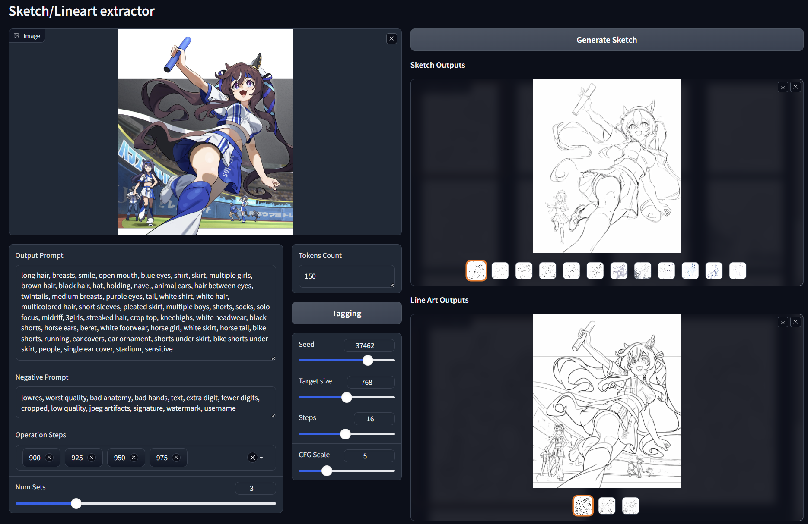
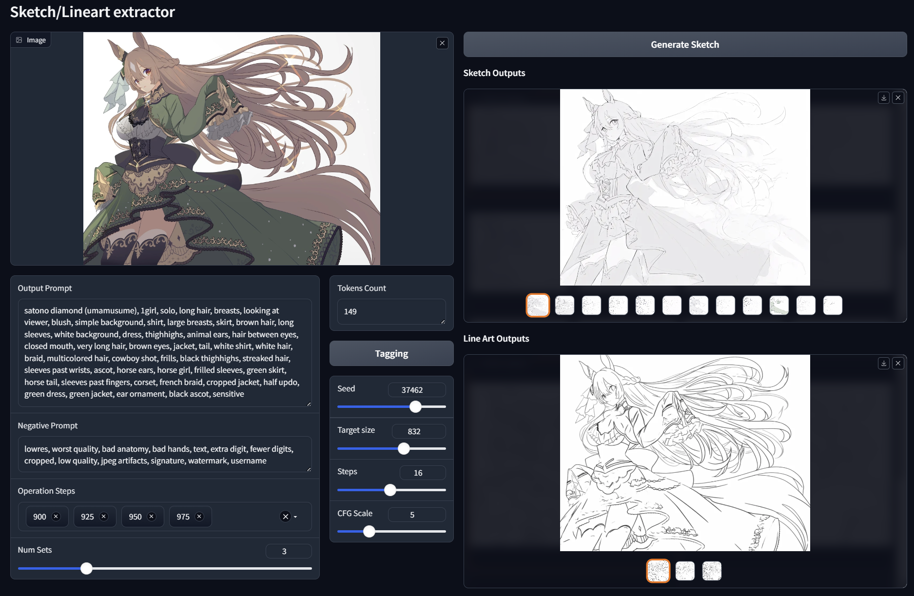
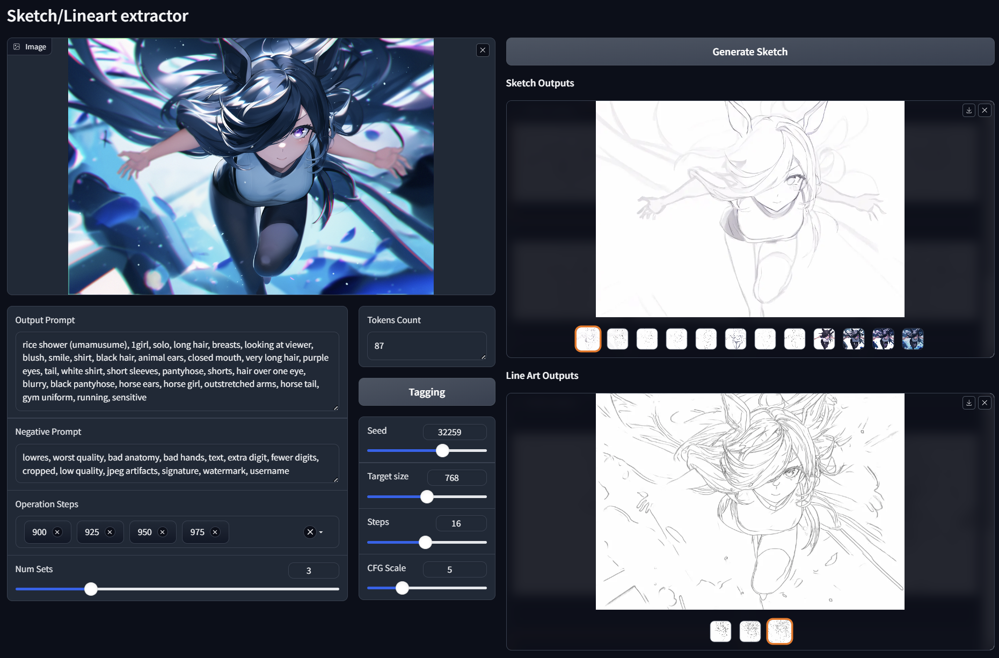
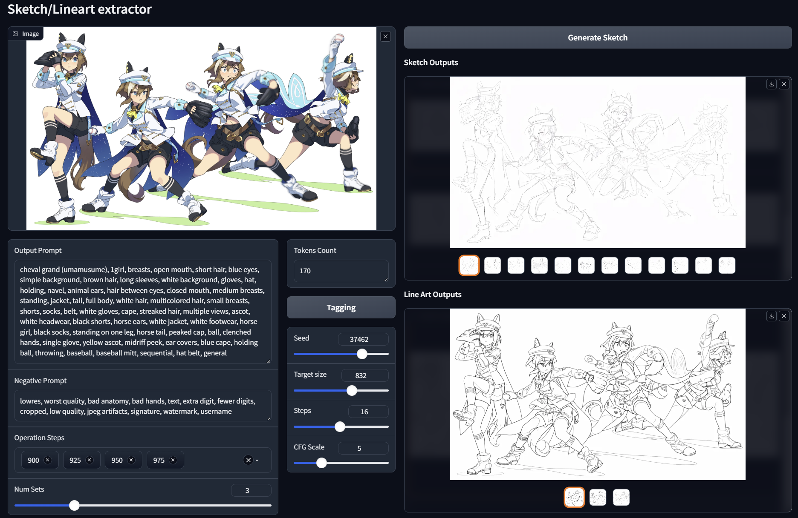
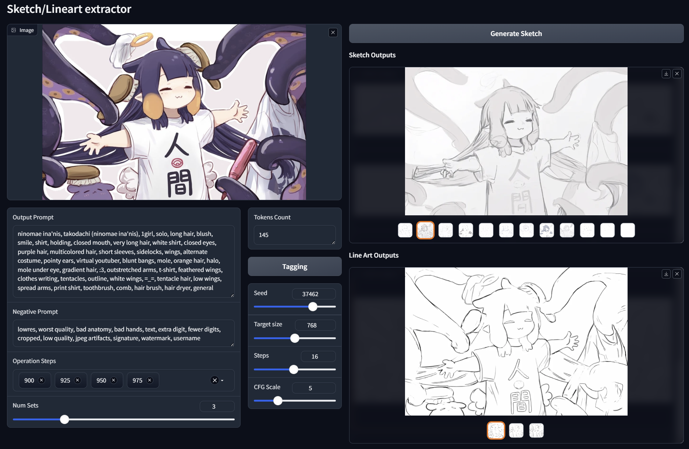

# Sketch-Gen built on Paints-Undo project

PaintsUndo: A Base Model of Drawing Behaviors in Digital Paintings

* original repo: https://github.com/lllyasviel/Paints-UNDO
* original project page: https://lllyasviel.github.io/pages/paints_undo/

SketchGen: An Image-to-Sketch tools for making synthetic dataset or generating references.

* Built upon PaintsUndo.

### Examples:

|||
|-|-|
|||

## Get Started

You can deploy SketchGen locally via:

* bash
  ```bash
  git clone -b sketch-gen https://github.com/KohakuBlueleaf/Paints-UNDO Sketch-Gen
  cd Sketch-Gen
  python3 -m venv venv
  source ./venv/bin/activate
  pip install xformers
  pip install -r requirements.txt
  python app.py
  ```
* powershell(windows)
  ```powershell
  git clone -b sketch-gen https://github.com/KohakuBlueleaf/Paints-UNDO Sketch-Gen
  cd Sketch-Gen
  python -m venv venv
  ./venv/Scripts/activate.ps1
  pip install xformers
  pip install -r requirements.txt
  python app.py
  ```

(If you do not know how to use these commands, you can paste those commands to ChatGPT and ask ChatGPT to explain and give more detailed instructions.)

## What this fork aims to?

* Making synthetic dataset for image/lineart/sketch pairs.
  * Can be used for training sketch to lineart models.

## What this fork changed?

* Use xformers for single frame model.
  * PR: https://github.com/lllyasviel/Paints-UNDO/pull/47
* Support CLIP longer than 77 token.
  * PR: https://github.com/lllyasviel/Paints-UNDO/pull/48
* Use lineart model from controlnet repo as reference to select best sketch:
  * Use lineart/lineart-anime/manga-line models.
  * Use LPIPS between generate sketch and linearts to select best sketch image.
* Use WD tagger v3 model instead of v2 model.
  * https://huggingface.co/SmilingWolf/wd-swinv2-tagger-v3
